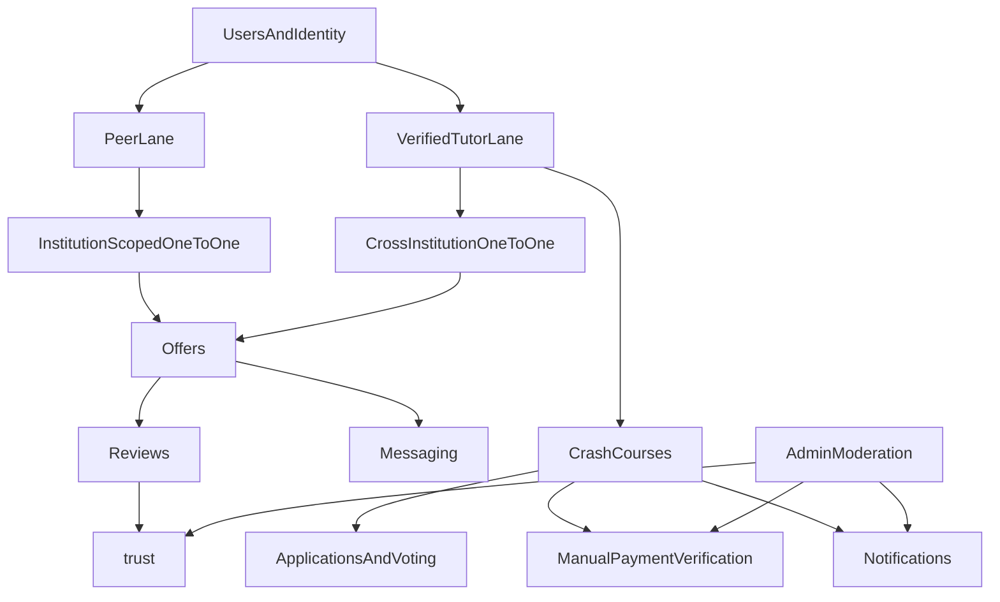

# Business Logic Hardening Discovery

## Purpose

This document translates the current backend and product narrative into a launch-focused business logic spec for the first 1,000 users. The goal is to finalize the product rules first, then harden the backend to enforce them.

## Locked V1 Decisions

- Launch scope: multi-university plus exam-prep categories.
- Default users are peers first; verified tutors are a separate elevated lane with broader marketplace access.
- Institution means university only for peer one-to-one flows; exam-prep categories have no institution boundary.
- Peer one-to-one help is institution-scoped by default.
- Same-institution peers can charge for one-to-one help.
- Verified tutors can offer one-to-one help across institutions.
- When a tutor from another institution applies to a one-to-one request, the student must be warned that the help is cross-institution and likely online.
- Crash courses are tutor-led products; peers must apply and be verified as tutors before they can run or teach them.
- Tutor verification remains a launch soft-gate for visibility and privileges rather than a universal block on account creation.
- Crash courses are the only commission-bearing product at launch.
- Payments remain off-platform for now. Students pay externally, send proof manually, and seats follow a soft-hold then manual-verification flow.
- The payment-proof grace period is two hours.
- For demand-side crash courses, the organizer can either pick a tutor directly or open voting with a deadline. If voting times out, organizer fallback applies.
- If voting expires, the default is the top-voted tutor, but the organizer can override with a reason.
- Crash-course messaging should be a group chat created after tutor selection; the organizer is the admin, the tutor is visibly marked as tutor, and only payment-verified students join.
- Crash-course reviews require both payment verification and explicit attendance, and only students review the tutor after completion.
- If a crash course is cancelled after payment verification, the organizer proposes a mediation outcome and an admin approves it.
- Cross-institution tutors in one-to-one help should get a clear warning only; they should not receive an automatic ranking penalty.
- Tutors and peers should receive different UI treatment, and verified tutors should visibly carry a verified badge.
- Tutor attendance marking is the attendance signal that unlocks crash-course review eligibility.
- Crash-course mediation outcomes are limited to full refund or platform credit / wallet balance.
- Platform credit should remain indefinitely reusable.
- Crash-course group chat should become read-only or archived after course completion.

## Product Domains

## 1. Current Implemented Business Logic

### 1.1 Users, identity, onboarding

- Clerk auth creates or updates backend users through `users.store`.
- New users default to `role: student`, `verificationTier: none`, `reputation: 0`, `currency: PKR`, `language: en`, `theme: system`.
- `users.completeOnboarding` sets role, bio, university, teaching scope, and creates a tutor profile for tutors.
- `users.setRole` allows free switching between `student` and `tutor`.
- Terms acceptance and onboarding completion are stored, but not consistently enforced as prerequisites for tutoring or transactions.
- Banned users are blocked by default via `requireUser()`, though some read paths allow banned access explicitly.

### 1.2 Tutor identity, offerings, credentials, trust

- Tutor profiles store bio, presence, and settings such as `acceptingRequests`, `minRate`, and allowed help types.
- Tutor offerings support either a course-linked offering or a custom subject/category offering.
- Credentials can be uploaded and reviewed by admins.
- Verification tiers are derived in `trust.ts`:
  - `expert`: at least 3 approved credentials and average rating at least 4.5
  - `academic`: at least 1 approved credential
  - `identity`: fallback on recalculation
- Reviews update `ratingSum`, `ratingCount`, and `reputation`.
- Verification and profile settings affect display and ranking, but are not consistently hard gates for tutoring eligibility.

### 1.3 One-to-one help requests and offers

- Students can create tickets with a course or free-form category, title, description, urgency, help type, budget, and deadline.
- Ticket creation is rate-limited to 10 per 5 minutes.
- Tutors can browse open tickets, search tickets, and view recommendations.
- Tutors can place one priced offer per ticket.
- Offer creation is rate-limited to 5 per minute.
- Students can accept one offer:
  - chosen offer becomes `accepted`
  - sibling offers become `rejected`
  - ticket becomes `in_session`
  - `assignedTutorId` is set
  - a conversation is created between the two users
  - the tutor is notified
- Students can resolve tickets; resolving a ticket notifies the accepted tutor.

### 1.4 Messaging and notifications

- Conversations are one-to-one and keyed only by user pair.
- A new conversation can be created only after an accepted offer exists between the two users.
- Messages support `text`, `image`, and `file`.
- Message send is rate-limited to 30 per minute.
- Sending updates the conversation's `lastMessageId` and `updatedAt`, and creates or updates a `new_message` notification for the other participant.
- Message read state and notification read state are maintained separately.
- Notification preferences are stored on users but are not enforced by notification writers.

### 1.5 Reviews and reports

- Ticket reviews exist in two directions:
  - student to tutor
  - tutor to student
- Student-to-tutor review is allowed once an accepted offer exists.
- Tutor-to-student review requires ticket resolution.
- Reports support a fixed reason set, are rate-limited to 5 per hour, and can be resolved or dismissed by admins.

### 1.6 Crash courses

- Two modes exist:
  - supply-side: tutor creates a course and students enroll directly
  - demand-side: organizer creates a request, tutors apply, organizer may vote or choose directly
- Crash-course creation is rate-limited to 5 per 5 minutes.
- Tutor application is rate-limited to 10 per 5 minutes.
- Demand flow currently supports:
  - `requesting`
  - optional `voting`
  - tutor selection
  - confirmation window
  - possible `pending_tutor_review`
  - `confirmed`
  - `in_progress`
  - `completed` or `cancelled`
- Supply flow currently supports:
  - `open`
  - direct enrollments
  - optional lock-in or auto-confirm when `minEnrollment` is met
- Notifications cover applications, voting open, tutor selected, confirmation, low enrollment, cancellation, and reminders.
- Manual payment verification is not yet modeled in backend state; current seat confirmation logic is enrollment-driven rather than payment-proof-driven.

### 1.7 Admin, moderation, and auxiliary features

- Admin can ban users, set verification, set admin role, manage announcements, and view audit logs.
- Two report-resolution paths exist: `reports.resolve` and `admin.resolveReport`.
- `study_groups.ts` provides a simple counter-based group flow without real memberships.
- `portfolio.ts` and profile completeness exist as supporting profile/discovery features.
- `debug.ts` currently exposes a dangerous public `clearAll` mutation.

## 2. Desired V1 Launch Business Logic

### 2.1 Marketplace scope and actors

- The marketplace serves:
  - university students seeking one-to-one help
  - university students seeking crash courses
  - exam-prep learners for O Levels, A Levels, SAT, IB, AP, and general prep
- Every user starts as a peer.
- Peers can ask for help and offer one-to-one help within their own institution context.
- For peers, institution means university only.
- Exam-prep categories are not institution-bounded.
- Tutors are a separate elevated role that users apply into and are approved for.
- Verified tutors can teach across institutions and across broader categories, including crash courses and exam-prep contexts.
- The platform is initially a broker and trust layer, not a full payments platform.

### 2.2 Tutor trust model

- Peer status and tutor status should not be treated as the same thing.
- Any onboarded user may participate as a peer.
- Tutor status should require an application and verification process.
- Verification is not a hard gate for joining the platform, but it should materially affect trust, visibility, and marketplace access.
- Tutor credibility should be category-specific rather than one flat trust model.
- Tutor profiles should communicate at least:
  - university affiliation
  - what they teach
  - category fit: university subject vs exam prep
  - evidence of competence
  - reviews and past teaching outcomes
- whether the person is acting as a peer or as a verified tutor
- Cross-university tutors should be clearly labeled as cross-institution rather than silently treated as equivalent to same-institution peers.
- Tutor evidence should be category-specific:
  - university subjects: grade or transcript-style proof plus prior tutoring/teaching history
  - exam prep: score or grade proof plus prior tutoring/teaching history
  - crash courses: past crash-course outcomes, attendance, ratings, and repeat demand where available
- Prior tutoring or teaching history may be shown through "others taught" style evidence that is verified by admin.
- Profiles should use visible badges or labels for the evidence types that have been verified.
- Verified tutors should receive distinct UI treatment from peers, including a visible verified badge.

### 2.3 One-to-one request lifecycle

- A student creates a request for a specific course, topic cluster, assignment, exam-prep need, or similar one-to-one help need.
- Same-institution peers may respond to one-to-one requests within their own institution.
- Same-institution peers may charge for one-to-one help.
- Verified tutors may respond to one-to-one requests across institutions.
- If a responder is cross-institution, the student should be explicitly told before accepting that the help will likely be online and may not match the exact institution context.
- Cross-institution tutor offers should show a warning, but they should not be automatically ranked lower purely for being cross-institution.
- The student chooses one tutor.
- Acceptance should create a bounded engagement, not just an open-ended relationship.
- Resolution should represent that the one-to-one engagement is done.
- Reviews should happen only after the engagement is actually complete, not merely after tutor selection.
- The platform does not process one-to-one payments at launch; this flow is matching and trust only.

### 2.4 Crash-course lifecycle

#### Supply-side crash courses

- Only verified tutors can publish a crash course proactively.
- Students discover the course and request a seat.
- A seat should not count as fully confirmed until payment proof is manually verified.
- If the course requires a minimum number of paid students, that rule should be enforced explicitly.
- If the course has a maximum number of seats, that capacity must be enforced before paid confirmation is finalized.

#### Demand-side crash courses

- An organizer creates a crash-course request with timing, topic, expected demand, and pricing expectations.
- Only verified tutors apply with a concrete proposal.
- Organizer chooses the selection mode:
  - direct organizer pick
  - voting with a deadline
- If voting is used and students do not vote in time, the organizer gets fallback selection authority.
- The organizer should not lose control of the crash-course request because of low participation in the voting step.
- Once a tutor is selected, students move into a payment and confirmation flow.
- Manual payment verification should determine final seat confirmation.
- Low-enrollment, late-payment, and cancellation rules need to be explicit.

### 2.5 Money and commission model

- Crash courses are commission-bearing products.
- Payments remain off-platform in V1.
- Payment proof is submitted outside the payment gateway flow and manually verified by the platform.
- Students should receive a soft hold first, then confirmed enrollment only after manual verification.
- If payment proof is late, invalid, or disputed, the student gets a two-hour grace period before the seat is released or manually resolved.
- If a crash course is cancelled after payment verification, the organizer proposes the mediation path and an admin approves it.
- The system should distinguish at least:
  - interested
  - awaiting payment proof
  - payment proof submitted
  - manually verified
  - confirmed seat
  - withdrawn or expired

### 2.6 Messaging rules

- One-to-one messaging should use one persistent thread per user pair, but it must remain segmented by request or job context.
- One-to-one conversations should preserve the peer-vs-tutor context and cross-institution status of the accepted engagement.
- Crash-course communication should use a group chat.
- The organizer should be the group admin or moderator.
- The tutor should be explicitly marked as the tutor in the chat.
- The crash-course group chat should be created only after tutor selection, and only organizer, tutor, and payment-verified students should be included.
- After crash-course completion, the group chat should become read-only or archived rather than remain fully active.
- Read state and unread notification state should stay aligned.

### 2.7 Reviews, disputes, and moderation

- Reviews should only be allowed after a completed engagement.
- Crash-course reviews should be available only after completion, only for students who are both payment-verified and marked attended by the tutor, and only students should review the tutor.
- Reports should support real moderation operations, not just a status flip.
- Admin actions should be auditable and not silently destroy unrelated user roles or state.

## 3. Remaining Product Decisions

- Whether platform credit should be transferable between product types later, or remain limited to crash-course mediation use cases in V1.
- Whether archived crash-course chats should remain visible to students forever or expire after a retention period.

## 4. Current-State vs Desired-State Gap Matrix

### 4.1 Users and tutor trust

| Area | Current state | Desired V1 | Gap |
|------|---------------|------------|-----|
| Peer vs tutor lanes | User can often behave like tutor directly in marketplace flows | Default peer lane plus separate verified tutor lane | Contradiction |
| Tutor entry | Any authenticated user can often act as tutor in practice | Tutor privileges should require application and verification | Contradiction |
| Verification | Verification affects display but not consistently visibility or ranking rules | Verification should gate tutor privileges and improve trust/visibility, with category-specific proof display and verified-badge UI treatment | Partial |
| Cross-institution trust | No explicit cross-institution policy display | Cross-institution tutor help should be clearly labeled and warned | Missing |
| Terms and onboarding enforcement | Stored but not consistently enforced | Should be explicit prerequisites where intended | Contradiction |

### 4.2 One-to-one marketplace

| Area | Current state | Desired V1 | Gap |
|------|---------------|------------|-----|
| Ticket and offer core flow | Implemented end-to-end | Keep as core one-to-one marketplace | Match |
| Peer one-to-one scope | Cross-institution behavior is effectively possible today | Peer one-to-one should be institution-scoped | Contradiction |
| Peer pricing | Current system allows priced offers without peer/tutor distinction | Same-institution peers may charge | Partial |
| Tutor eligibility on offers | Broadly any authenticated user | Same-institution peers plus verified tutors; cross-institution reserved for tutors | Contradiction |
| Cross-institution ranking | No warning-only distinction exists today | Cross-institution tutor offers should warn but not be auto-penalized in ranking | Missing |
| Conversation scope | User-pair based without request segmentation | Persistent pair thread with request or job context | Contradiction |
| Review timing | Student can review after accepted offer | Reviews should happen after completion | Contradiction |
| Payment model | No payment handling | Matching only, no in-platform payment | Match |

### 4.3 Messaging and notifications

| Area | Current state | Desired V1 | Gap |
|------|---------------|------------|-----|
| New conversation permission | Accepted offer required | Accepted engagement should be required | Partial |
| Continued messaging | Existing conversation membership is enough | Should align with engagement policy | Contradiction |
| One-to-one chat model | Pair thread exists but without explicit request segmentation | Pair thread should retain request or job context | Missing |
| Crash-course chat model | No group-chat concept exists | Group chat with organizer admin and tutor badge after payment verification | Missing |
| Notification preferences | Stored but ignored | Should either be enforced or explicitly deferred | Partial |
| Read state sync | Messages and notifications drift | Read state and unread state should align | Missing |

### 4.4 Crash courses

| Area | Current state | Desired V1 | Gap |
|------|---------------|------------|-----|
| Supply and demand modes | Both exist | Keep both modes | Match |
| Tutor requirement | Any authenticated user can effectively create/apply in practice | Crash-course teaching should be tutor-only | Contradiction |
| Organizer control | Organizer can select directly and voting is optional | Organizer-configurable direct-pick vs voting is correct | Match |
| Voting fallback | Current backend supports selection from `requesting` and `voting`, but fallback rules are not explicit | Voting timeout should default to top-voted tutor, with organizer override plus reason | Contradiction |
| Payment verification | Not modeled as seat states | Soft-hold then manual verification should drive confirmation | Missing |
| Payment grace period | No explicit grace-period behavior exists | Two-hour grace period for late, invalid, or disputed proof | Missing |
| Demand-side capacity | `maxEnrollment` is not reliably enforced after tutor selection | Capacity must be enforced on confirmed seats | Contradiction |
| Low-enrollment policy | Implemented but threshold behavior is weak in practice | Explicit and reliable low-enrollment outcomes | Contradiction |
| Supply-side confirmation | Can remain `open` or lock in weakly | Needs explicit minimum/confirmation rules | Partial |
| Crash-course group chat | Not implemented | Group chat should exist only for payment-verified participants after tutor selection | Missing |
| Crash-course chat completion state | No archive or read-only behavior exists | Group chat should become read-only or archived after completion | Missing |
| Crash-course reviews | Not implemented in live review flow | Reviews require completion, payment verification, and tutor-marked attendance | Missing |
| Cancellation mediation | No organizer-proposal/admin-approval mediation workflow exists | Organizer proposes and admin approves either full refund or indefinitely reusable platform credit | Missing |

### 4.5 Moderation and admin

| Area | Current state | Desired V1 | Gap |
|------|---------------|------------|-----|
| Reports | Basic create/list/resolve | Needs operationally meaningful moderation flow | Partial |
| Audit logging | Present on some admin paths | Should be consistent on real admin actions | Partial |
| Admin role handling | Revoking admin forces `student` role | Admin operations should not destroy prior marketplace role | Contradiction |
| Dangerous utilities | `debug.clearAll` is public | Must not be publicly callable | Contradiction |

### 4.6 Auxiliary features

| Area | Current state | Desired V1 | Gap |
|------|---------------|------------|-----|
| Study groups | Counter-based only, no memberships | Either real memberships or explicit de-scoping | Contradiction |
| Portfolio courses | Separate concept from marketplace courses | Needs clear product meaning or de-scope | Partial |
| Profile completeness | Some checks do not match source of truth | Should align with visible profile/edit flows | Partial |

## 5. Launch-Critical Hardening Backlog

### Phase 1: Immediate launch blockers

- Lock down or remove `debug.clearAll`.
- Define and enforce the peer lane vs verified tutor lane.
- Enforce institution-scoped peer one-to-one and tutor-only cross-institution one-to-one.
- Make crash-course teaching and applications tutor-only.
- Fix one-to-one review timing.
- Enforce pair-thread messaging with explicit request or job context.
- Enforce crash-course capacity and payment-confirmed seat states.

### Phase 2: Core marketplace trust and lifecycle

- Add cross-university trust labeling rules.
- Add category-specific tutor proof display, admin-verified evidence badges, and distinct tutor-vs-peer UI treatment.
- Align notification read state with message read state.
- Define crash-course payment verification states, two-hour grace-period handling, and manual verification admin flows.
- Define reliable low-enrollment and cancellation behavior, including indefinite credit handling.
- Add crash-course group chat, archive behavior, and crash-course review eligibility rules.

### Phase 3: Moderation and peripheral cleanup

- Unify report resolution and audit behavior.
- Fix admin role restoration semantics.
- Decide whether study groups ship in V1.
- Clarify the purpose of portfolio `courses`.
- Align profile completeness with actual visible tutor profile data.

## 6. Module-Oriented Next Implementation Phase

### Trust and tutor eligibility

- `convex/trust.ts`
- `convex/credentials.ts`
- `convex/users.ts`
- `convex/tutor_profiles.ts`
- `convex/tutor_offerings.ts`

Hardening themes:

- peer lane vs tutor lane
- tutor application and approval
- tutor privileges and dashboard access
- category-specific credibility evidence
- admin-verified evidence badges
- verified tutor badge UI treatment
- verification badges and ranking impact
- onboarding and terms prerequisites
- cross-institution trust signals

### One-to-one transactions

- `convex/ticket_workflows.ts`
- `convex/offer_workflows.ts`
- `convex/ticket_read_models.ts`
- `convex/offer_read_models.ts`
- `convex/reviews.ts`

Hardening themes:

- who can offer as peer vs tutor
- institution-scoped peer matching
- cross-institution tutor warnings
- ticket lifecycle authority
- acceptance and completion rules
- review timing

### Messaging

- `convex/message_workflows.ts`
- `convex/conversations.ts`
- `convex/conversation_read_models.ts`
- `convex/notification_service.ts`
- `convex/notifications.ts`

Hardening themes:

- engagement-scoped messaging
- pair thread with request segmentation
- crash-course group chat roles
- crash-course chat archive or read-only transition
- permission consistency
- unread/read alignment
- notification preference handling

### Crash courses

- `convex/crash_course_policy.ts`
- `convex/crash_course_workflows.ts`
- `convex/crash_course_enrollments.ts`
- `convex/crash_course_voting.ts`
- `convex/crash_course_crons.ts`
- `convex/crash_course_read_models.ts`

Hardening themes:

- organizer selection modes
- voting deadlines and fallback
- payment-proof and manual verification states
- two-hour grace-period handling
- seat capacity
- low-enrollment outcomes
- organizer-proposed admin-approved refund or credit mediation

### Moderation and operations

- `convex/admin.ts`
- `convex/reports.ts`
- `convex/debug.ts`
- `convex/audit.ts`

Hardening themes:

- audit consistency
- moderation workflow depth
- admin override semantics
- removing public unsafe operations

## 7. Success Criteria

- Every important user-visible behavior has a written launch rule.
- The remaining ambiguities are explicit product decisions rather than hidden code behavior.
- The current backend mismatches are known and grouped by owner.
- The next implementation phase can focus on enforcing approved rules rather than continuing discovery inside code changes.
